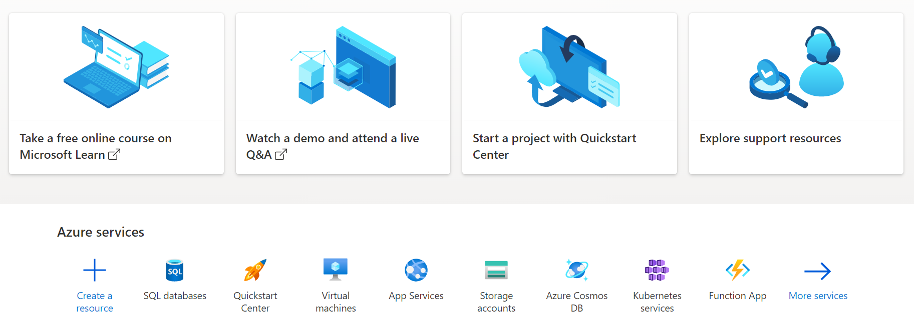
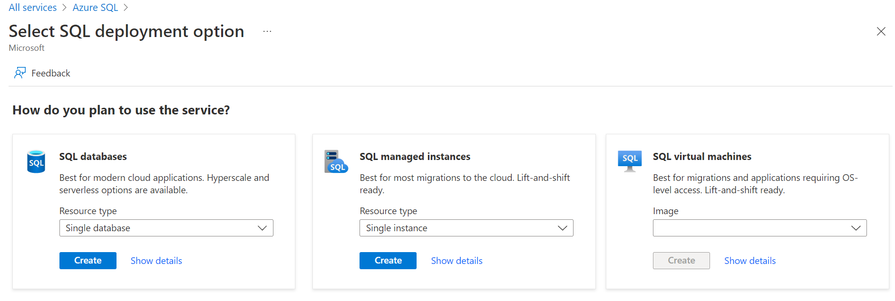
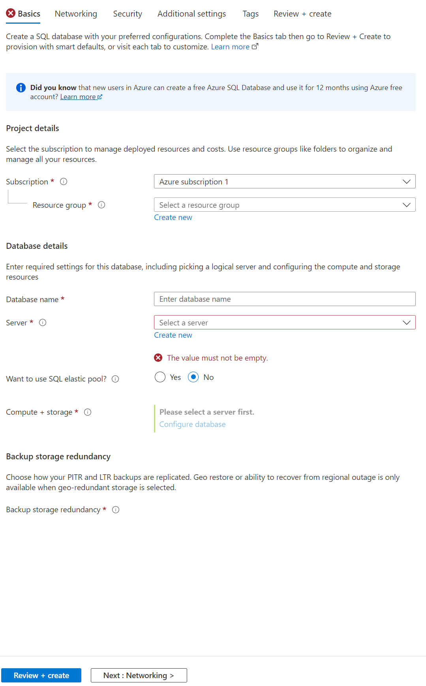
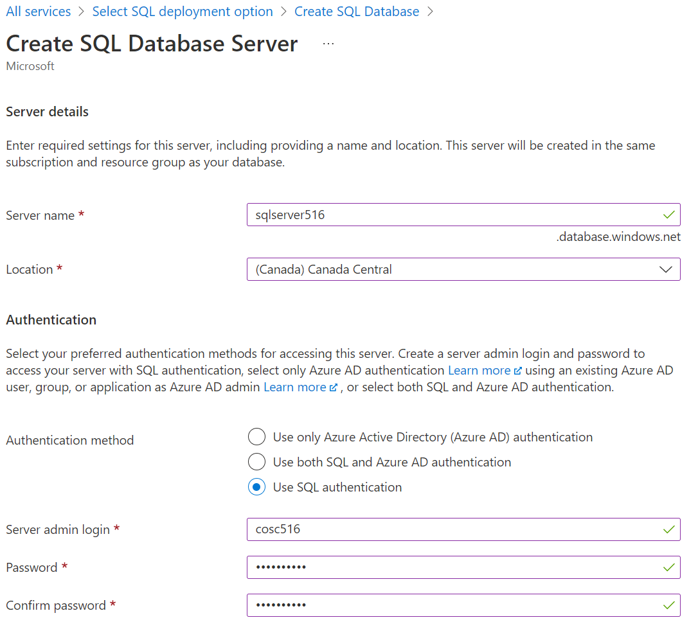
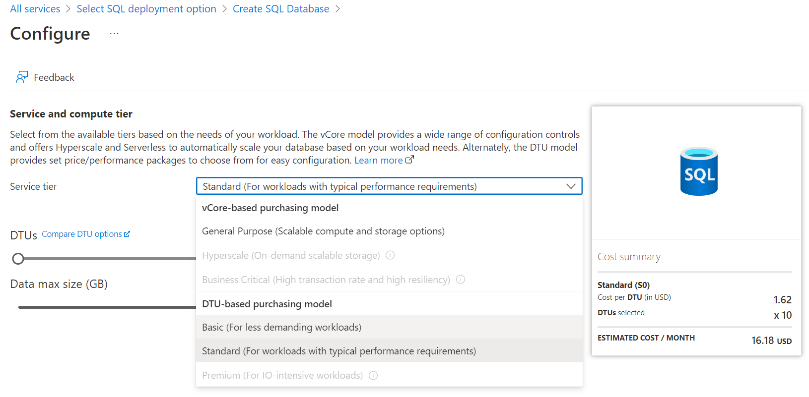
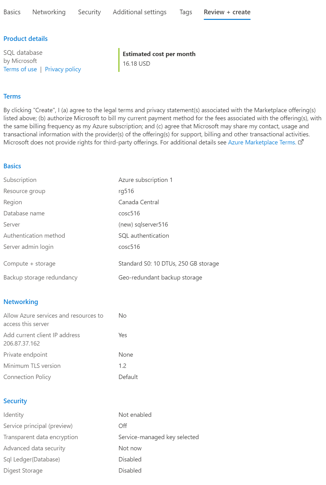
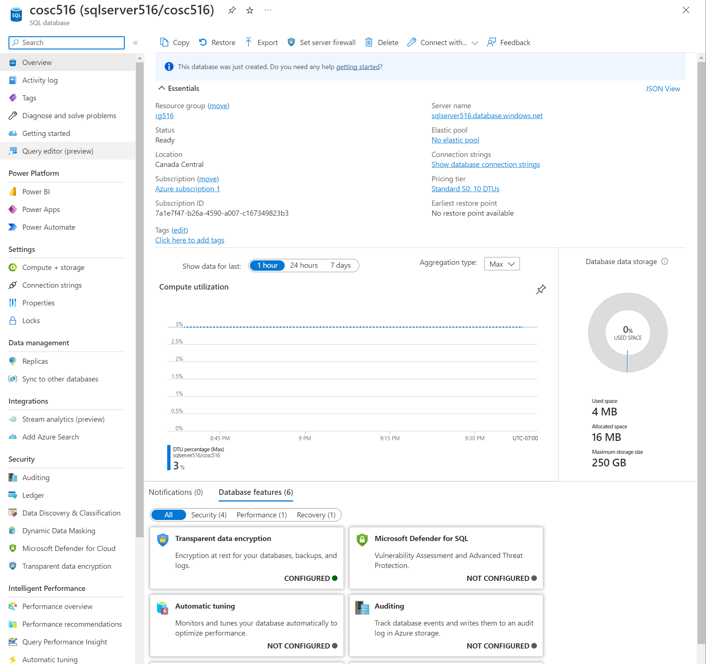
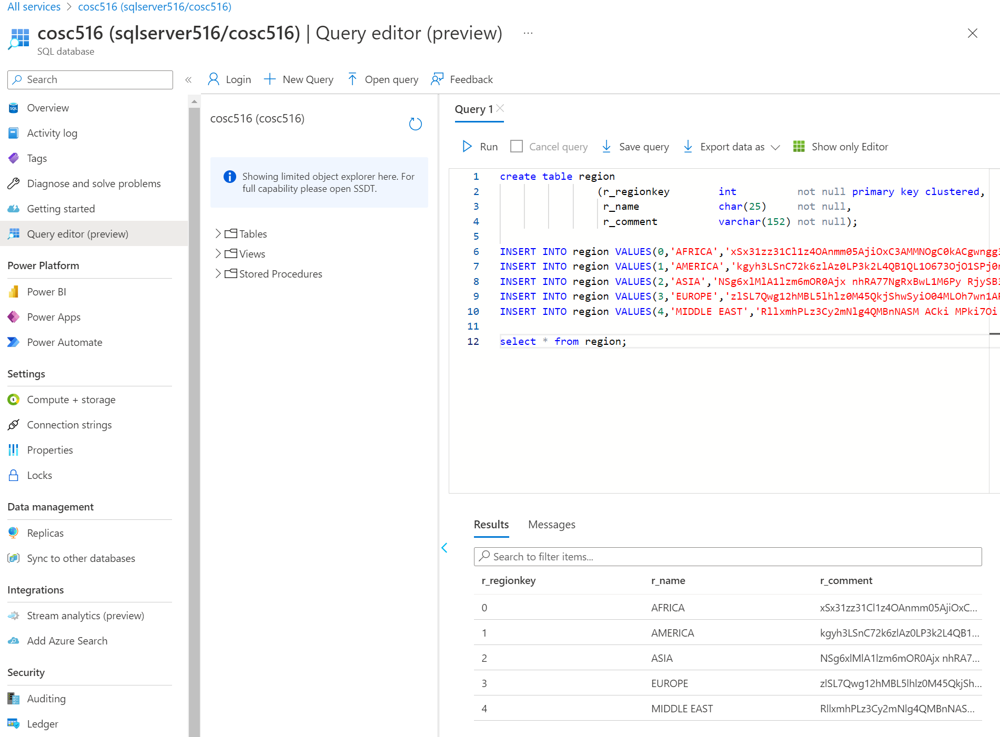

# COSC 516 - Cloud Databases<br/>Lab 2 -Microsoft Azure SQL

## Setup

Create a Azure free tier account at: [https://azure.microsoft.com/en-us/free/](https://azure.microsoft.com/en-us/free/).

The free tier account allows for free trials forever and 12-months free offers from your sign up period. You will need an email address to use. The sign-up also asks for a credit card. If you do not have a credit card, then a pre-paid credit card with a small amount should work.

## Azure Portal

Login to Azure. In the Azure Portal, click on `More services` then select `Databases` category. Select `Azure SQL`.




## Create Azure SQL Database

Click on `Create SQL database`. Select first option with `Single database` and click `Create`. 



For `Resource group` click `Create new` and use name `rg516`. For `Database name` use `cosc516`.



For `Server` click `Create new` and use name `sqlserver516`. For authentication select `Use SQL authentication`. For user id, use `cosc516` and select your password. For `Location` use `Canada Central`.



Under `Compute + storage`, you can leave as `Standard S0`. Alternatively, you can click `Configure database` and change to `Basic DTU-based purchasing model`. 



Click `Next: Networking`. On `Connectivity method` select `Public endpoint`. Click `Yes` to `Add current client IP address`. Leave with `Default Connection policy`. Click `Review + create`. Click `Create`.




## Connecting to the Database

Connecting to the database can be done using Azure Portl with `Query editor` or using open source software SQuirreL.

### Accessing using Query Editor

In Azure Portal search for `SQL databases` and select database just created. The instance information provides the server name, connection strings, and the ability to query using the `Query editor (preview)`. 



Test entering some SQL commands into the query editor.




### Accessing using SQuirreL

[SQuirreL](https://squirrel-sql.sourceforge.io/) is an open source graphical query tool capable of querying any JDBC-accessible database including Oracle, MySQL, and SQL Server.

Start up SQuirreL. Register our MySQL server with the information:

```
Name: 516_Azure
Login name: cosc516
Password: (password used when created)
Host name: (see Azure portal)
Port: (leave blank for default)
Database: (leave blank)
```


## Tasks

To test your database, write Java code using VS Code. The file to edit is `AzureSQL.java`.  The test file is `TestAzureSQL.java`.  Fill in the methods requested (search for **TODO**).  Marks for each method are below.  You receive the marks if you pass the JUnit tests AND have followed the requirements asked in the question (including documentation and proper formatting).

- +1 mark - Write the method `connect()` to make a connection to the database.
- +5 marks - Write the method `load()` to load the standard TPC-H data into the database. The DDL files are in the [ddl](ddl) folder. **Hint: Files are designed so can read entire file as a string and execute it as one statement.**
- +1 mark - Write the method `close()` to close the connection to the database.
- +2 marks - Write the method `drop()` to drop all the tables in the TPC-H database.
- +2 marks - Write the method `query1()` that ...
- +2 marks - Write the method `query2()` that ...
- +2 marks - Write the method  `orderCount()` that **uses a transaction** and returns the number of orders for a given customer id.
- +5 marks - Write the method `addOrder()` that **uses a transaction** to add an order and all lineitems to database assuming that the `ps_availqty` is >= `l_quantity` for all items that were requested to be ordered. Otherwise, transaction is denied.

**Total Marks: 20**

## Bonus Marks: (up to 2)

Up to +2 bonus marks for demonstrating some other feature of Azure SQL

## Submission

The lab can be marked immediately by the professor or TA by showing the output of the JUnit tests and by a quick code review.  Otherwise, submit the URL of your GitHub repository on Canvas. **Make sure to commit and push your updates to GitHub.**

