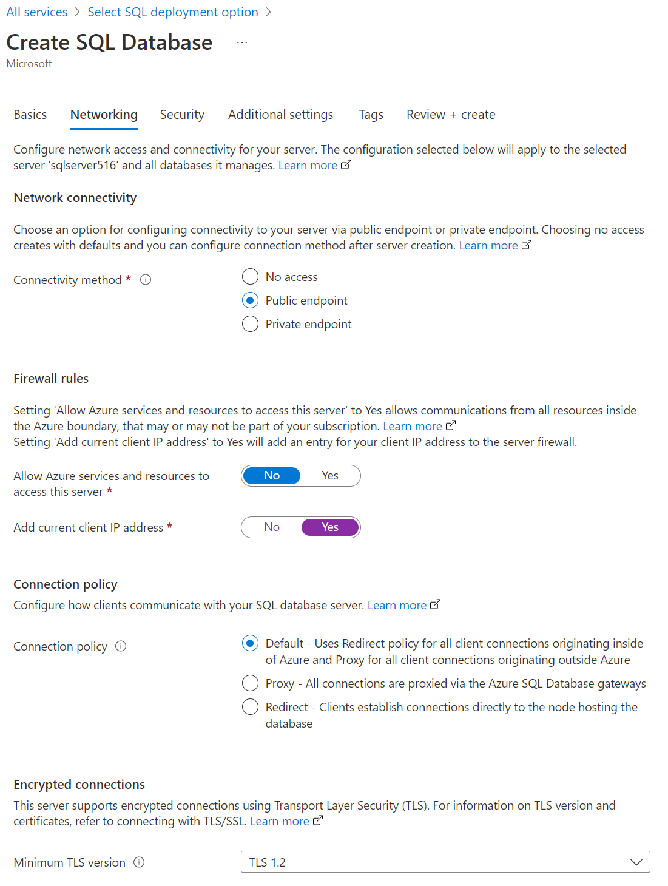

# COSC 516 - Cloud Databases<br/>Lab 2 -Microsoft Azure SQL

## Setup

Create a Azure free tier account at: [https://azure.microsoft.com/en-us/free/](https://azure.microsoft.com/en-us/free/).

The free tier account allows for free trials forever and 12-months free offers from your sign up period. You will need an email address to use. The sign-up also asks for a credit card. If you do not have a credit card, then a pre-paid credit card with a small amount should work.

## Azure Portal

Login to Azure. In the Azure Portal, click on `More services` then select `Databases` category. Select `Azure SQL`.


## Create Azure SQL Database

Click on `Create SQL database`. Select first option with `Single database` and click `Create`. 


For `Resource group` click `Create new` and use name `rg516`. For `Database name` use `cosc516`.


For `Server` click `Create new` and use name `sqlserver516`. For authentication select `Use SQL authentication`. For user id, use `cosc516` and select your password. For `Location` use `Canada Central`.


Under `Compute + storage`, you can leave as `Standard S0`. Alternatively, you can click `Configure database` and change to `Basic DTU-based purchasing model`. 


Click `Next: Networking`. On `Connectivity method` select `Public endpoint`. Click `Yes` to `Add current client IP address`. Leave with `Default Connection policy`. Click `Review + create`. Click `Create`.




## Connecting to the Database

Connecting to the database can be done using Azure Portl with `Query editor` or using open source software SQuirreL.

### Accessing using Query Editor

In Azure Portal search for `SQL databases` and select database just created. The instance information provides the server name, connection strings, and the ability to query using the `Query editor (preview)`. 


Test entering some SQL commands into the query editor.


### Accessing using SQuirreL

[SQuirreL](https://squirrel-sql.sourceforge.io/) is an open source graphical query tool capable of querying any JDBC-accessible database including Oracle, MySQL, and SQL Server.

Start up SQuirreL. Register our MySQL server with the information:

```
Name: 516_Azure
Login name: cosc516
Password: (password used when created)
Host name: (see Azure portal)
Port: (leave blank for default)
Database: (leave blank)
```


## Tasks

To test your database, write Java code using VS Code. The file to edit is `MySQLonAWS.java`.  The test file is `TestMySQLonAWS.java`.  Fill in the methods requested (search for **TODO**).  Marks for each method are below.  You receive the marks if you pass the JUnit tests AND have followed the requirements asked in the question (including documentation and proper formatting).

- +1 mark - Method `connect()` to make a connection to the database.
- +1 mark - Method `connectSSL()` to make a secure connection to the database. Requires updating database configuration on RDS.
- +1 mark - Method `close()` to close the connection to the database.
- +1 mark - Method `drop()` to drop the table "person" that we will be using.
- +2 marks - Method `create()` to create a "person" table with fields:
  	- id - integer, must auto-increment
	- name - variable character field up to size 40
	- salary - must hold up to 99,999,999.99 exactly
	- birthdate - date
	- last_update - timestamp	
- +3 marks - Method `insert()` to add the following records.  **You must use PreparedStatements to get full marks.**	

```
name, salary, birthdate, last_update
1, Ann Alden, 123000.00, 1986-03-04, 2022-01-04 11:30:30.0
2, Bob Baron, 225423.00, 1993-12-02, 2022-01-04 12:30:25.0
3, Chloe Cat, 99999999.99, 1999-01-15, 2022-01-04 12:25:45.0
4, Don Denton, 91234.24, 2004-08-03, 2022-01-04 12:45:00.0
5, Eddy Edwards, 55125125.25, 2003-05-17, 2022-01-05 23:00:00.0
```

- +1 mark - Write the method `delete()` to delete the person with name `'Bob Baron'`.</li>
- +2 marks - Write the method `query1()` that returns the person name and salary where rows are sorted by salary descending.</li>
- +2 marks - Write the method `query2()` that returns the person's last name and salary if the person's salary is greater than the average salary of all people.</li>
- +2 marks - Write the method `query3()` that returns all fields of a pair of people where a pair of people is returned if the last_update field of their records have been updated less than an hour apart. Do not duplicate pairs.  Example: Only show (Ann, Bob) and not also (Bob, Ann).</li>

**Total Marks: 20**

## Bonus Marks:

- +3 bonus marks for configuring multi-AZ fail-over and testing query when have failure (requires not using free-tier)
- 

## Submission

The lab can be marked immediately by the professor or TA by showing the output of the JUnit tests and by a quick code review.  Otherwise, submit the URL of your GitHub repository on Canvas. **Make sure to commit and push your updates to GitHub.**

